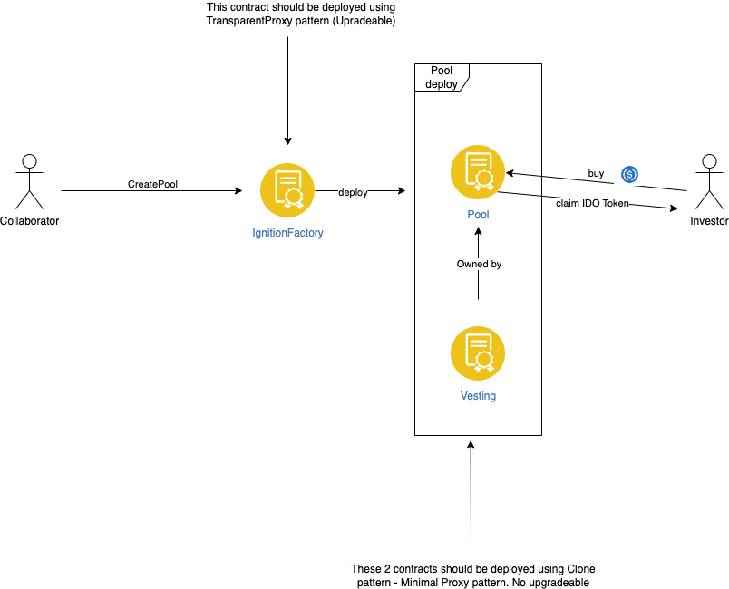

# High Level Architecture


- Main contracts: IgnitionFactory, Pool, Vesting.
   - `IgnitionFactory`: This contract will be used to deploy a pair of Pool + Vesting contracts for collaborators.
      - The contract is upgradeable using the TransparentProxy pattern.
      - Collaborators can create a pool by calling the CreatePool function.
    - `Pool`: This contract will serve as the main contract for investors and collaborators for most IDO actions, such as buying tokens, claiming IDO tokens, funding tokens, etc.
      - The Pool Contract uses the Clone (Minimal proxy) pattern to reduce gas fees during deployment.
    - `Vesting`: This contract will be used as a utility contract to separate the vesting logic from the Pool contract.
      - The Vesting Contract uses the Clone (Minimal proxy) pattern to reduce gas fees during deployment.
      - Owner of vesting contract should be a corresponding `Pool` contract. Not an EOA.

- Business logic:
  - We're currently using 
# Step to deploy contracts

Prerequisites:
 - In the IgnitionFactory contract, there are some parameters that need to be configured before production deployments. Please change them to reasonable numbers if needed, depending on your business:
  ```
     /// @dev Lockup duration after TGE Date
    uint public constant LOCKUP_DURATION = 5 minutes;

    /// @dev Minimum galaxy participation fee percentage for pool deployment
    uint16 public constant MINIMUM_GALAXY_PARTICIPATION_FEE_PERCENTAGE = 0;
    /// @dev Minimum crown participation fee percentage for pool deployment
    uint16 public constant MINIMUM_CROWN_FUNDING_PARTICIPATION_FEE_PERCENTAGE = 0;

    /// @dev Maximum galaxy participation fee percentage for pool deployment
    uint16 public constant MAXIMUM_GALAXY_PARTICIPATION_FEE_PERCENTAGE = 5000;
    /// @dev Minumum crown participation fee percentage for pool deployment
    uint16 public constant MAXIMUM_CROWN_FUNDING_PARTICIPATION_FEE_PERCENTAGE = 5000;
    
    /// @dev Maximum TGE Date adjustment when it comes to TGE Update
    uint public constant MAXIMUM_TGE_DATE_ADJUSTMENT = 365 days;
  ``` 

1. Create .env file and fill with private key of deployer, infura key (if you do not use infura endpoint, you can change rpc endpoint of network in hardhat.config.ts)

1. Deploy all IDO Smart contracts (includes Vesting, Pool, PoolFactory) 

```
# For Ethereum
yarn deploy:mainnet 
# For BSC
yarn deploy:binance 
```


2. Deploy a sample contract for all IDO pools

```
# For Ethereum
yarn deploy:mainnet --tags POOL
# For BSC
yarn deploy:binance --tags POOL
```

3. Deploy a sample contract for all IDO vesting

```
# For Ethereum
yarn deploy:mainnet --tags VESTING
# For BSC
yarn deploy:binance --tags VESTING
```

3. Deploy contract pool factory (with upgradeable proxy pattern)

```
# For Ethereum
yarn deploy:mainnet --tags FACTORY
# For BSC
yarn deploy:binance --tags FACTORY
```

4. Set implementation contract for pool and vesting in Factory contract

# Step to verify contracts

1. Verify pool contract

```
# For Ethereum
yarn deploy:mainnet --tags VERIFICATION_POOL
# For BSC
yarn deploy:binance --tags VERIFICATION_POOL
```

2. Verify vesting contract

```
# For Ethereum
yarn deploy:mainnet --tags VERIFICATION_VESTING
# For BSC
yarn deploy:binance --tags VERIFICATION_VESTING
```

3. Verify pool factory contract

```
# For Ethereum
yarn deploy:mainnet --tags VERIFICATION_FACTORY
# For BSC
yarn deploy:binance --tags VERIFICATION_FACTORY
```

# Step to update pool implementation or vesting implementation contract

1. Deploy new sample for IDO pool contract

```
# For Ethereum
yarn deploy:mainnet --tags POOL
# For BSC
yarn deploy:binance --tags POOL
```

2. Deploy new sample for IDO vesting contract

```
# For Ethereum
yarn deploy:mainnet --tags VESTING
# For BSC
yarn deploy:binance --tags VESTING
```

3. Change pool or vesting implementation address in pool factory contract

# Step to update factory contract
1. Deploy new factory implementation
```
# For Ethereum
yarn deploy:mainnet --tags FACTORY
# For BSC
yarn deploy:binance --tags FACTORY
```
2. Update implementation for factory proxy in DefaultProxyAdmin contract

# Library:

- merkletreejs {MerkleTree}

- ethers/lib/utils {keccak256}

- ethers-v5 {ethers.utils.solidityKeccak256, ethers.utils.BigNumber}

# Create Merkle tree:

- Leaf = { address + hash("User type") + max purchase KYC/notKYC amount + max purchase for each user base on allocation }

- Type of investors:

  - (1) WHALE + KYC

  - (2) WHALE + Not KYC

  - (3) NORMAL_USER + KYC

  - (4) NORMAL_USER + Not KYC

- Type of pool groups:

  - (x) Galaxy pool

  - (y) Early access

  - (z) Normal access

- Type of leaves:

  - (a) { address + hash(WHALE) + max purchase KYC amount + maxPurchaseBaseOnAllocation }

  - (b) { address + hash(WHALE) + max purchase KYC amount + 0 }

  - (c) { address + hash(WHALE) + max purchase **NOT** KYC amount + maxPurchaseBaseOnAllocation }

  - (d) { address + hash(WHALE) + max purchase **NOT** KYC amount + 0 }

  - (e) { address + **hash(NORMAL_USER)** + max purchase KYC amount + 0 }

  - (f) { address + **hash(NORMAL_USER)** + max purchase **NOT** KYC amount + 0}

- Mapping between leaves, investors and pools:

| Investor | Group | Leaves |       Note       |     | Investor | Group | Leaves |        Note        |
| :------: | :---: | :----: | :--------------: | :-: | :------: | :---: | :----: | :----------------: |
|   (1)    |  (x)  |  (a)   |                  |     |   (3)    |  (x)  |        | **Can not happen** |
|   (1)    |  (y)  |  (b)   |                  |     |   (3)    |  (y)  |        | **Can not happen** |
|   (1)    |  (z)  |  (e)   | Can use leaf (f) |     |   (3)    |  (z)  |  (e)   |  Can use leaf (f)  |
|   (2)    |  (x)  |  (c)   |                  |     |   (4)    |  (x)  |        | **Can not happen** |
|   (2)    |  (y)  |  (d)   |                  |     |   (4)    |  (y)  |        | **Can not happen** |
|   (2)    |  (z)  |  (f)   |                  |     |   (4)    |  (z)  |  (f)   |

# Calculate rate and decimal variable in Pool contract

We have price of 1 IDO Token is x Purchase Token (like: USDT, USDC, BUSD,...)

For short, we will call IDO Token is **Itoken**, Purchase Token is **Ptoken**.

We also call the minimum basic unit of Itoken and Ptoken is **wItoken** and **wPtoken** respectively.

We will call decimal of IDO Token and Purchase Token is **Ide** and **Pde** respectively.

```
1 (IDO Token) = x (Purchase Token)

1 (Itoken) = x (Ptoken)

10^Ide (wItoken) = x*10^Pde (wPtoken)

1 (wItoken) = x*10^(Pde-Ide) (wPtoken)

1 / (x*10^(Pde-Ide)) (wItoken) = 1 (wPtoken)

amount / (x*10^(Pde-Ide)) (wItoken) = amount (wPtoken)

amount (wPtoken) = amount / (x * 10^(Pde-Ide)) (wItoken) = amount * 10^(Ide-Pde) / x (wItoken)
```

But in Solidity, we can not use float number, so if x = 0.005 or Ide < Pde, x and 10^(Ide-Pde) will equal 0.

So we need to store price of IDO token (x) in another way and process in case decimal of IDO Token smaller than one of Purchase Token.

## First, process value of x:

- If x<1 like x = 0.8 = 1/1.25 = 10^2 / 125, then we call store 2 and 125 in contract and then calculate x by x = 10^2 / 125

Let call 125 and 2 in this case are **rate and decimal of x**. For short, we will call them are **ratex** and **dex**, so we have:

> > x = 0.8 = 10^2 / 125 = 10^(dex) / ratex

> > ratex = 10^(dex) / x

Let see 1/0.8 = 1.25, we can not store 1.25 in contract, so {dex} will help us.

Let count the decimal digit of 1.25 >> There are 2 digits in decimal part of this number

So we have {dex} >= 2, rate will be an Integer number, not a float number (like 12.5 or 1.25)

We will set {dex} = 2 and then ratex = 1.25 \* 10^2 = 125. Then we will store {ratex = 125} and {dex = 2} in contract to display the value of x = 10^2 / 125 = 0.8

- If x>=1 like x = 80, so we have rate = 10^(dex) / 80 = 1/80 _ 10^(dex) = 0.0125 _ 10^(dex)

We will store rate in contract, so we need rate is not a float number like 0.0125 >> So {dex} will help us.

Let count the decimal digit of 0.0125 >> There are 4 digits in decimal part of this number

So we have {dex} >= 4, rate will be an Integer number, not a float number (like 12.5 or 1.25)

We will set {dex} = 4 and then rate = 0.0125 \* 10^4 = 125. Then we will store {ratex = 125} and {dex = 4} in contract to display the value of x = 10^4 / 125 = 80

- **Summary, dex = {the number digit of decimal part of 1/x}, ratex = 1/x\*10^(dex)**

- Special case, if 1/x is an irrational number like x = 0.3 >> 1/x = 3.333333333333... or x = 28 => 1/x = 0.0357142857...

We need to increase or limit value of {dex}.

Example with x < 1: x = 0.3 >> 1/x = 3.333333... >> dex is infinity

So we can set dex = 18 and ratex = 3_333333_333333_333333, so {ratex} and {dex} in contract will be {3_333333_333333_333333} and {18} (not absolutely accurate but minimize error in calculation)

Example with x >= 1: x=28 >> 1/x = 0.0357142857142857142857142857142857142857... >> dex is infinity

So we can set dex = 18 and ratex = 35714285714285714, those will be store in contract to display x = 28

## Second, process with Ide - Pde:

Now we have formula to calculate amount of IDO token without x:

amount (wPtoken) = amount _ 10^(Ide-Pde) / x (wItoken) = amount _ 10^(Ide-Pde) \* ratex / 10^(dex) (wItoken) **(1)**

- If Ide < Pde, we can write reverse formula like this: amount (wPtoken) = amount \* ratex / 10 ^ (dex + Pde - Ide) (wItoken).

Pde - Ide > 0, so we can increase {dex} an amount is {Pde-Ide} in contract.

Let call result of dex+Pde-Ide is **final decimal** or **de** for short.

> > amount (wPtoken) = amount \* ratex / 10 ^ de (wItoken). **(2)**

- If Ide >= Pde, we have Pde-Ide < 0, so we consider de = dex, then compare **(1)** and **(2)**, we can declare new {rate} variable:

> > rate = 10^(Ide-Pde) \* ratex

> > amount (wPtoken) = amount \* rate / 10 ^(dex) (wItoken)

And now instead storing value of ratex and dex in contract, we will display price of IDO token (x) by {de} and {rate} value\*\*

- **Summary, if Ide < Pde, rate = ratex, de = dex+Pde-Ide and if Ide >= Pde, rate = ratex\*10^(Ide-Pde), de = dex**

## Conclude and example:

- To display in contract the price of IDO token (x), which is set by user and with meaning 1 IDO token = x Purchase token. Developer need to calculate some value and store in contract, which is called **rate** and **decimal** variable.

```
- dex = {the number digit of decimal part of 1/x}, ratex = 1/x*10^(dex) (with 1/x is irrational number, dex = 18)

- If Ide < Pde, rate = ratex, de = dex+Pde-Ide **OR** if Ide >= Pde, rate = ratex*10^(Ide-Pde), de = dex
```

- In contract, we use formula: **amount (wPtoken) can buy => amount \* rate / 10 ^(de) (wItoken)**

**Example:**

- x = 0.08, Ide = 18, Pde = 6 >> 1/x = 12.5 >> dex = 1 >> ratex = 125 >> rate = 125\*10^12 >> de = 1

Normal: amount = 90 Purchase Token >> can buy 90/0.08 = 1125 IDO Token

Formula: amount = 90 _ 10^6 (wPtoken) >> can buy 90 _ 10^6 _ 125 _ 10^12 / 10 ^1 = 1125 \* 10^18 (wItoken)

- x = 0.028, Ide = 6, Pde = 8 >> 1/x = 35.7142857143... >> dex = 18 >> ratex = 35_714285_714285_714285 >> rate = 35_714285_714285_714285 >> de = 20

Normal: amount = 90 Purchase Token >> can buy 90/0.028 = 3214.285714 IDO Token

Formula: amount = 90 _ 10^8 (wPtoken) >> can buy 90 _ 10^8 \* 35_714285_714285_714285 / 10 ^ 20 = 3214285714 (wItoken)

- x = 10, Ide = 10, Pde = 18 >> 1/x = 0.1 >> dex = 1 >> ratex = 1 >> rate = 1 >> dex = 9

Normal: amount = 90 Purchase Token >> can buy 90/10 = 9 IDO Token

Formula: amount = 90 _ 10^18 (wPtoken) >> can buy 90 _ 10^18 * 1 / 10 ^ 9 = 9*10^10 (wItoken)

- x = 55, Ide = 8, Pde = 6 >> 1/x = 0.01818181818... >> dex = 18 >> ratex = 18181818181818181 >> rate = 1818181818181818100 >> de = 18

Normal: amount = 90 Purchase Token >> can buy 90/55 = 1.636363 IDO Token

Formula: amount = 90 _ 10^6 (wPtoken) >> can buy 90 _ 10^6 \* 1818181818181818100 / 10 ^ 18 = 163636363 (wItoken)

# Code style:

## Order of Functions

- constructor
- receive function (if exists)
- fallback function (if exists)
- external
- public
- internal
- private
- Within a grouping, place the view and pure functions last.

# Order of Layout

- Type declarations
- State variables
- Events
- Errors
- Modifiers
- Functions

# Integrate Foundary

- When integrate foundary, hardhat-coverage not working well
- forge coverage not working well with solidity version ^0.4.0 (which is used by USDT), so need to use: "forge coverage --contracts contract/core"

# Deprecated:

## ~~Note when calling function to buy token:~~

~~- If purchase token is USDC in ETH/Goerli, we can use buyToken...WithPermit() functions.~~

~~- DAI token also has permit function, but parameters of this function is different from permit function of ERC20 token stardard of openzeppelin.~~
